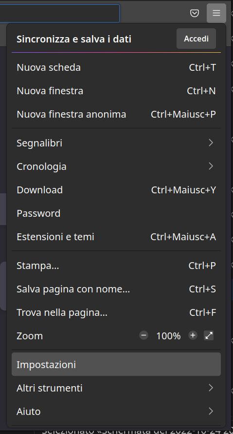
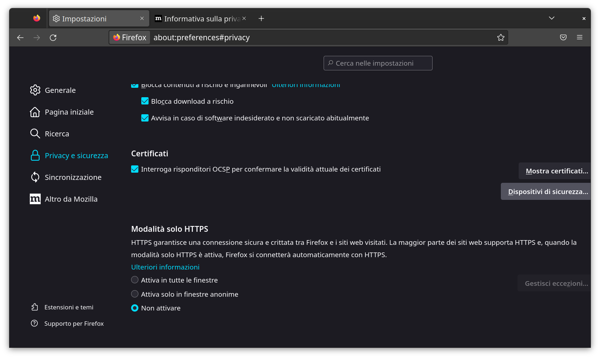
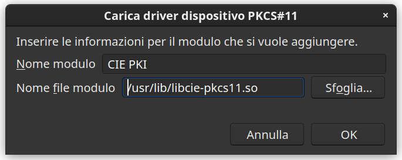
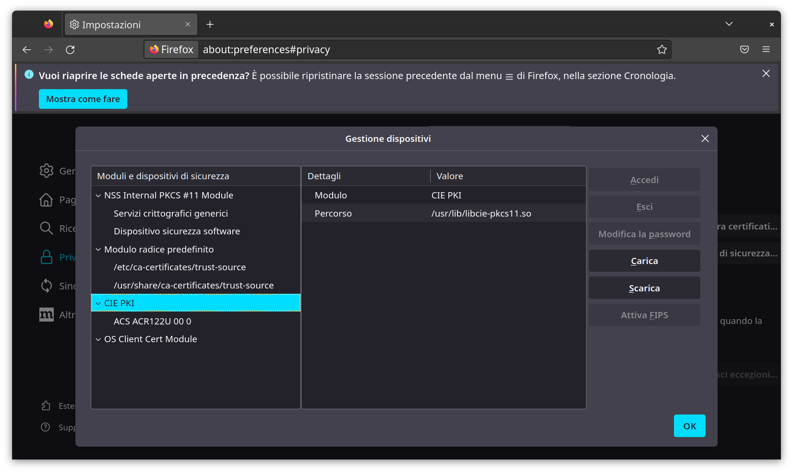
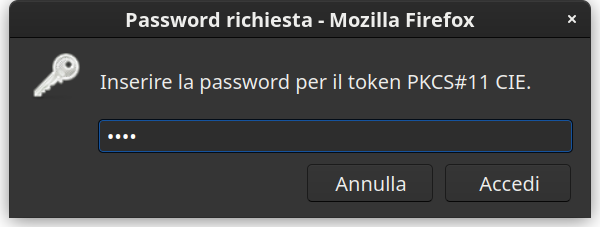

# Come usare Cie ID

Avvia il browser Firefox per iniziare la configurazione. Clicca sul pulsante
delle impostazioni, in alto a destra, quindi su **Impostazioni**.

Selezionare la scheda **Privacy e Sicurezza** nella buca di ricerca e clicca su
**Dispositivi di sicurezza**.

Clicca su **Carica**, digita **CIE PKI** nel campo **Nome modulo** e seleziona
il file **/usr/lib/libcie-pkcs11.so**.

Clicca su **Apri** per confermare la scelta, quindi su OK per confermare il
caricamento del modulo.

Per autenticarti con la CIE, digita l’URL del servizio di tuo interesse e clicca
sul pulsante **Entra con CIE**.

Quando richiesto, procedi ad effettuare l’abilitazione della tua CIE sul
computer, necessaria solo per il primo utilizzo.

Ti occorrerà il codice
[PIN]("https://www.cartaidentita.interno.gov.it/cosa-pin-puk-utilizzarli/")
composto da 4 cifre ricevute al momento di presentazione della domanda e altre 4
cifre che ti sono state recapitate a casa insieme alla nuova Carta di Identità
Elettronica.

**Ricorda**: dopo aver terminato l'abilitazione, ogni volta che ti sarà
richiesto l'inserimento del PIN è necessario inserire solo le ultime 4 cifre del
PIN.

**[Clicca qui](https://www.cartaidentita.interno.gov.it/richiesta-di-ristampa/)**
se hai smarrito il PIN.

Terminata l’abilitazione, ti verrà richiesto di scegliere il certificato con cui
accedere al servizio e di inserire la seconda metà del PIN.

Inserito il PIN, clicca su OK o premi INVIO per accedere al servizio.

In caso di difficoltà, contatta il servizio di assistenza per i cittadini
secondo le modalità indicate all’indirizzo
[https://www.cartaidentita.interno.gov.it/contatti/](https://www.cartaidentita.interno.gov.it/contatti/).

Se vuoi cambiare il PIN o l’hai dimenticato e intendi cambiarlo (avrai bisogno
del PUK) consulta il manuale del Software CIE per conoscere la procedura.

Il manuale è disponibile all’indirizzo
[https://www.cartaidentita.interno.gov.it/software-cie/](https://www.cartaidentita.interno.gov.it/software-cie/).
